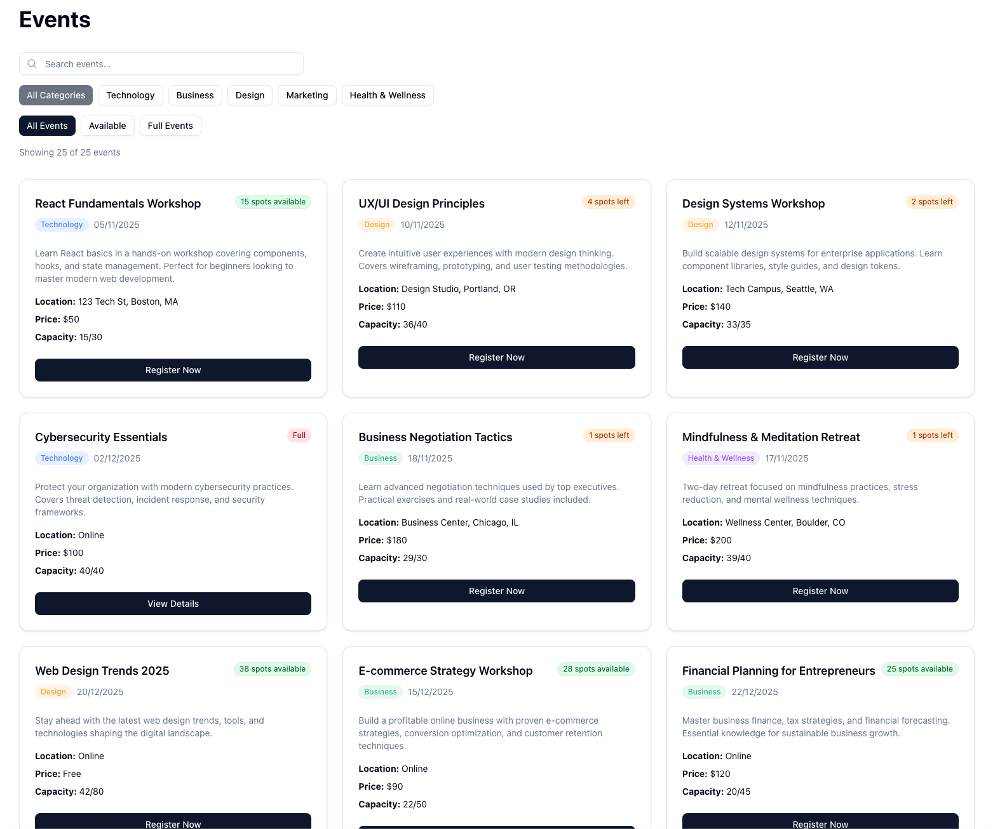
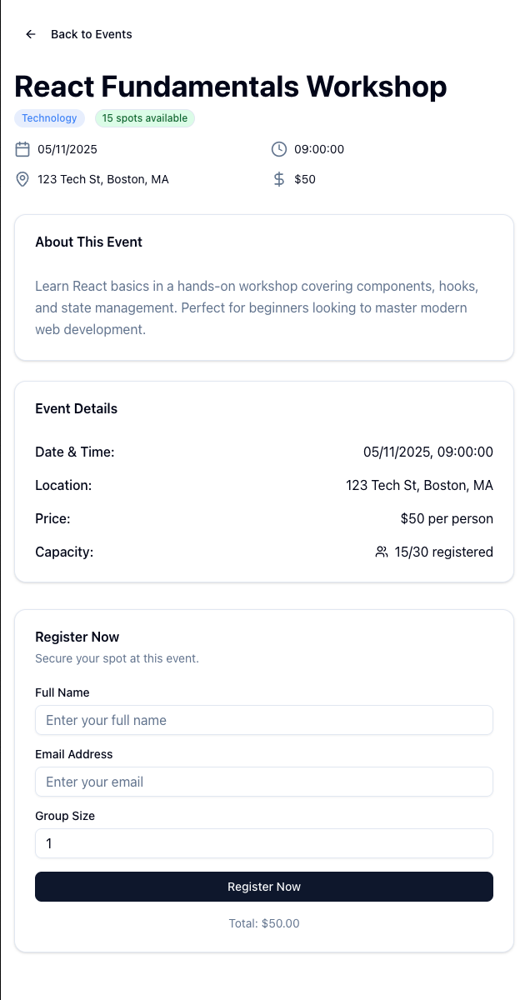

# Events Platform

A modern events platform built for the Full Stack Technical Test, solving common challenges faced by organizations managing events. Built in 1 hour using AI-assisted development.

## 🔗 Deployed URL

**Live Demo:** [https://events-platform-bay.vercel.app/](https://events-platform-bay.vercel.app/)

### Screenshots

**Events Listing Page:**


**Event Registration & Waitlist:**


## ⚡ My Approach

### Technology Choices:

- **Frontend**: Next.js 16 with App Router + React 19.2 + TypeScript
- **Styling**: Tailwind CSS v4 with shadcn/ui component library
- **Forms**: React Hook Form with Zod validation and @hookform/resolvers
- **State Management**: React hooks with server-side JSON persistence for waitlist management
- **API Architecture**: Next.js API routes for secure server-side external API calls
- **Deployment**: Vercel (seamless Next.js integration)

### AI Tool Usage:

- **Claude Code**: Primary AI assistant for rapid development, architecture decisions, and debugging
- **Workflow**: AI-assisted component creation, API design, TypeScript interface generation, and responsive design implementation
- **Problem Solving**: Used AI to solve Next.js 16 async params compatibility issues and optimize build performance

### Bonus Feature (implemented):

**🎯 Event Capacity & Waitlists (Enhanced with JSONBin.io Cloud Storage)**

- Events show capacity status: Available/Few spots left/Full/Waitlist
- **Real global waitlist management** - Multiple users share the same queue
- **JSONBin.io external storage** - Cloud-based key-value store for production scalability
- **True position tracking** - Real queue positions across all users (#1, #2, #3...)
- **API-driven architecture** - Custom waitlist endpoints for scalable management
- **Cross-device functionality** - Waitlist status syncs across browsers/devices
- **Serverless compatible** - Works in Vercel and other serverless environments

### Key Design Decisions:

- **Security First**: API keys stored server-side only, never exposed to frontend
- **Responsive Design**: Mobile-first approach with seamless desktop scaling
- **User Experience**: Optimistic updates, loading states, and comprehensive error handling
- **Component Architecture**: Reusable shadcn/ui components with consistent design system
- **Form Validation**: Schema-based validation with real-time feedback
- **Performance**: Static generation where possible, dynamic rendering for data-driven pages

## ✨ Features

### Core Features ✅

- **Events Listing**: Grid layout with search, category filtering, and status filters
- **Event Details**: Comprehensive event pages with registration forms
- **Responsive Design**: Optimized for mobile, tablet, and desktop
- **Working Deployment**: Production-ready build and deployment

### Bonus: JSONBin.io Cloud Waitlist System ✅

- **Real Global Queue Management** - JSONBin.io cloud storage shared across all users
- **True Position Tracking** - User A = #1, User B = #2, User C = #3 (not everyone #1!)
- **API-Driven Waitlists** - POST/DELETE/GET endpoints for waitlist operations
- **External Key-Value Storage** - JSONBin.io provides persistent cloud-based JSON storage
- **Production Scalability** - Works in serverless environments (Vercel, Netlify, etc.)
- **Real-Time Updates** - Live waitlist positions and total counts
- **Cross-User Functionality** - Multiple users see the same accurate queue

### Additional Enhancements

- Toast notifications for user feedback
- Loading states and error handling
- Optimistic UI updates
- Professional design with consistent branding
- Accessibility-focused component library

## 🚀 Getting Started

### Installation

```bash
# Clone the repository
git clone <repository-url>
cd events-platform

# Install dependencies
npm install
```

### Environment Setup

Create a `.env.local` file in the root directory:

```bash
# External Events API
API_BASE_URL=https://x15zoj9on9.execute-api.us-east-1.amazonaws.com/prod
API_KEY=your-api-key-here

# JSONBin.io for waitlist storage (get free account at https://jsonbin.io)
JSONBIN_API_KEY="your-jsonbin-master-key-here"
JSONBIN_BIN_ID=your-bin-id-here
```

**JSONBin.io Setup:**
1. Create a free account at [jsonbin.io](https://jsonbin.io)
2. Create a new bin with initial content: `{}`
3. Copy your Master Key and Bin ID to the environment variables above
4. Note: Escape special characters in the API key with quotes and backslashes

### Development

```bash
# Start development server
npm run dev

# Open http://localhost:3000 in your browser
```

### Build

```bash
# Build for production
npm run build

# Start production server
npm run start
```

### Lint

```bash
# Run ESLint
npm run lint
```

## 🏗️ Architecture

### Project Structure

```
├── app/                 # Next.js App Router pages
│   ├── api/            # API routes (secure external API proxy + waitlist endpoints)
│   │   ├── events/     # External events API proxy
│   │   └── waitlist/   # Custom waitlist management API
│   ├── events/         # Event listing and detail pages
│   └── layout.tsx      # Root layout with metadata
├── components/ui/      # shadcn/ui component library
├── lib/               # Utilities and API clients
│   ├── api.ts         # Server-side API client
│   ├── client-api.ts  # Frontend API client
│   ├── types.ts       # TypeScript interfaces
│   ├── utils.ts       # Utility functions
│   ├── server-waitlist.ts    # Server-side waitlist management (JSONBin.io storage)
│   └── waitlist-api.ts       # Client-side waitlist API wrapper
└── public/            # Static assets
```

### API Security

- External API calls handled server-side via Next.js API routes
- API keys never exposed to frontend/browser
- Type-safe API interfaces throughout

### Waitlist Storage Architecture

- **External Key-Value Store**: JSONBin.io provides cloud-based JSON storage
- **Serverless Compatible**: Works in Vercel, Netlify, and other serverless platforms
- **Global Persistence**: Data survives server restarts and deployments
- **Real-Time Sync**: Multiple users see the same accurate queue positions
- **API-Driven**: RESTful endpoints for all waitlist operations (join/leave/status)

### State Management

- React hooks for component state
- JSONBin.io cloud storage for global waitlist persistence
- API-driven waitlist management with real-time updates
- Optimistic updates for better UX

## 🤝 Contributing

### Development Workflow

1. Fork the repository
2. Create a feature branch: `git checkout -b feature/amazing-feature`
3. Make your changes with clear commit messages
4. Test your changes: `npm run build`
5. Push to your branch: `git push origin feature/amazing-feature`
6. Open a Pull Request

### Code Standards

- TypeScript strict mode enabled
- ESLint configuration with Next.js rules
- Consistent component patterns using shadcn/ui
- Server-side security for all external API calls

### Testing

```bash
# Ensure build passes
npm run build

# Check for linting issues
npm run lint
```

## 📄 License

This project is licensed under the MIT License - see below for details:

```
MIT License

Permission is hereby granted, free of charge, to any person obtaining a copy
of this software and associated documentation files (the "Software"), to deal
in the Software without restriction, including without limitation the rights
to use, copy, modify, merge, publish, distribute, sublicense, and/or sell
copies of the Software, and to permit persons to whom the Software is
furnished to do so, subject to the following conditions:

The above copyright notice and this permission notice shall be included in all
copies or substantial portions of the Software.

THE SOFTWARE IS PROVIDED "AS IS", WITHOUT WARRANTY OF ANY KIND, EXPRESS OR
IMPLIED, INCLUDING BUT NOT LIMITED TO THE WARRANTIES OF MERCHANTABILITY,
FITNESS FOR A PARTICULAR PURPOSE AND NONINFRINGEMENT. IN NO EVENT SHALL THE
AUTHORS OR COPYRIGHT HOLDERS BE LIABLE FOR ANY CLAIM, DAMAGES OR OTHER
LIABILITY, WHETHER IN AN ACTION OF CONTRACT, TORT OR OTHERWISE, ARISING FROM,
OUT OF OR IN CONNECTION WITH THE SOFTWARE OR THE USE OR OTHER DEALINGS IN THE
SOFTWARE.
```

---
